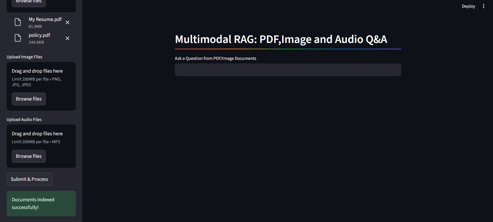
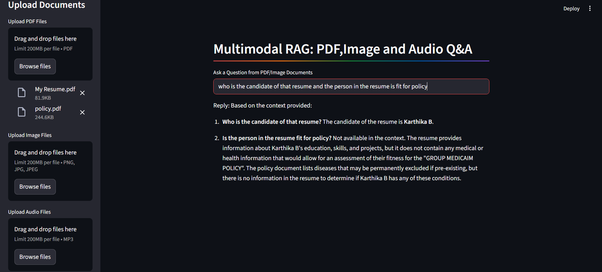
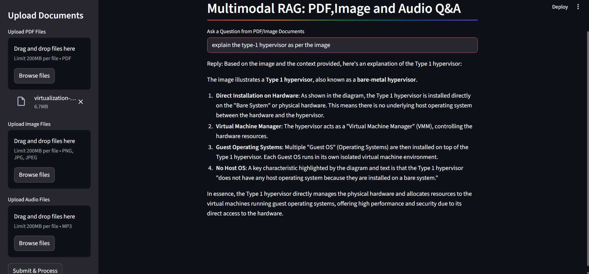
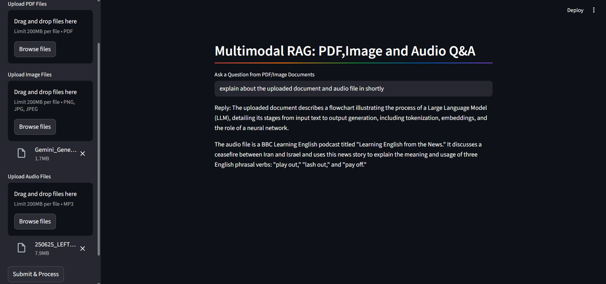

# Intelligent Multimodal Local RAG – QA Assistant

A **local Multimodal Retrieval-Augmented Generation (RAG) system** that enables **Question Answering over PDFs, Images, and Audio files** using a Streamlit-based UI. This project runs fully **online/openAI model**, leveraging vector search (FAISS) and LLM-based reasoning to provide context-aware answers from user-uploaded documents.

---

## Project Webpages

## 🚀 Features

* 📄 **PDF Question Answering** – Ask questions from resumes, policies, reports, and other documents
* 🖼️ **Image-based Q&A** – Extract and reason over text content from images
* 🔊 **Audio-based Q&A** – Ask questions from uploaded audio files (speech-to-text supported)
* 🧠 **Multimodal RAG Pipeline** – Combines retrieval + generation for accurate responses
* 🔍 **FAISS Vector Index** – Efficient similarity search over embedded content
* 🧩 **Local Execution** – No cloud dependency; runs entirely on your machine
* 🌐 **Streamlit UI** – Clean and interactive web interface

---

## 🖼️ Application Demo

### 🏠 Home Interface


### 📂 Document Upload Section


### 💬 Question Answering Output


### 🧠 System Architecture


---


## 🏗️ Project Architecture

```
User Query
   ↓
Document Upload (PDF / Image / Audio)
   ↓
Text Extraction (OCR / STT / PDF Parsing)
   ↓
Text Chunking
   ↓
Embedding Generation
   ↓
FAISS Vector Store (Local)
   ↓
Relevant Context Retrieval
   ↓
LLM Response Generation
```

---

## 📂 Project Structure

```
Intelligent-Multimodal-local-RAG-QA-Assistant/
│
├── data/                 # Uploaded and processed documents
├── faiss_index/          # Stored FAISS vector indexes
├── sapp.py               # Main Streamlit application
├── requirements.txt      # Project dependencies
├── .gitignore
└── README.md
```

---

## 🧑‍💻 Tech Stack

* **Python 3.10**
* **Streamlit** – UI framework
* **FAISS** – Vector similarity search
* **LangChain / LLM utilities** (as applicable)
* **OCR / Speech-to-Text** – For image & audio processing
* **OpenAI / Local LLMs** (configurable)

---

## ⚙️ Installation

### 1️⃣ Clone the Repository

```bash
git clone https://github.com/<your-username>/Intelligent-Multimodal-local-RAG-QA-Assistant.git
cd Intelligent-Multimodal-local-RAG-QA-Assistant
```

### 2️⃣ Create Virtual Environment (Recommended)

```bash
python -m venv venv
source venv/bin/activate   # On Windows: venv\Scripts\activate
```

### 3️⃣ Install Dependencies

```bash
pip install -r requirements.txt
```

---

## ▶️ Running the Application

```bash
python embed_server.py
streamlit run sapp.py
```

The app will be available at:

```
http://localhost:8501
```

---

## 🧪 Example Use Case

* Upload **MyResume.pdf** and **policy.pdf**
* Ask: *"Who is the candidate in the resume and are they eligible for the policy?"*
* The system:

  * Extracts content from both documents
  * Retrieves relevant sections
  * Provides a grounded, context-aware answer

---

## 🔐 Privacy & Security

* All files are processed **locally**
* No document data is stored externally
* Ideal for **sensitive documents** such as resumes, medical policies, and internal reports

---

## 📌 Limitations

* Eligibility or medical fitness cannot be inferred unless explicitly stated in documents
* OCR accuracy depends on image quality
* Audio clarity impacts transcription quality

---

## 🛠️ Future Enhancements

* ✅ Support for video-based Q&A
* ✅ Advanced document-level citations
* ✅ Multi-language support
* ✅ UI-based index management
* ✅ Integration with fully local LLMs (LLaMA, Mistral, etc.)

---

## 👩‍💻 Author

**Karthika B**
AI & Full Stack Enthusiast

---

## ⭐ Acknowledgements

* FAISS by Meta AI
* Streamlit Community
* Open-source LLM ecosystem

---

## 📜 License

This project is open-source and available under the **MIT License**.

---

If you find this project useful, don’t forget to ⭐ the repository!
